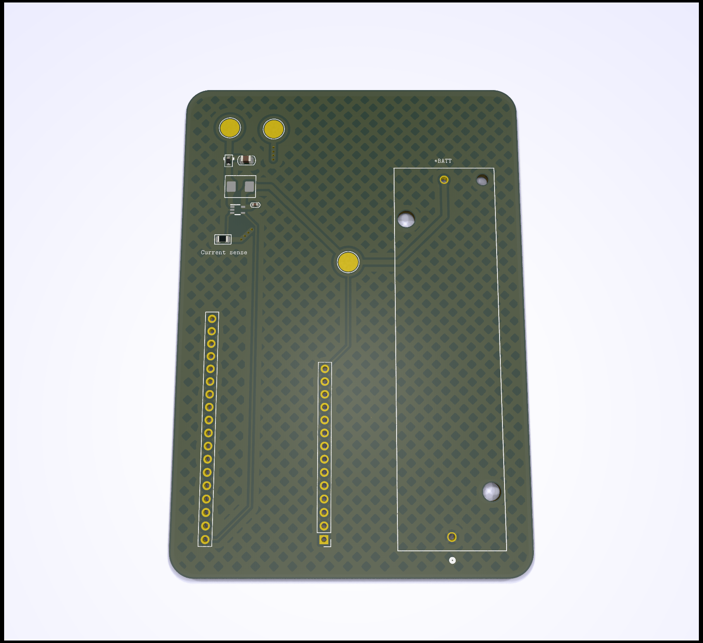

# Esp32 battery powered Zigbee fairy lights

A little thing I threw together this christmas.

It uses a DFRobot firebeetle2 esp32c6 as a zigbee end device, which is then used
to manage the output of a LED driver.

This is then used to power some outdoor fairy lights.
